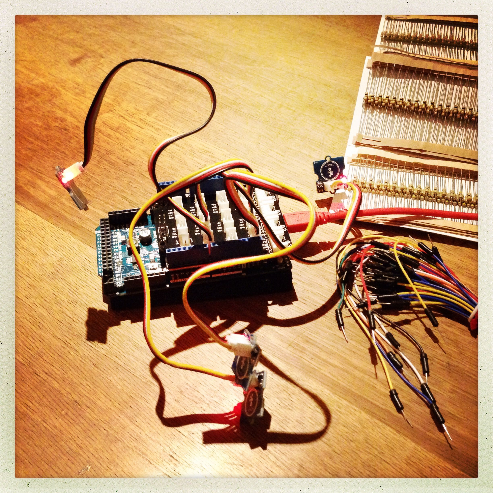

# Learning Trail

Etapes de la découverte du monde de l'Arduino.

## Session 1 · 20.11.2014 · Brancher, compiler, écouter

* Montage du circuit du [détecteur de présence](https://github.com/MuseomixLeman/Equipe-6/tree/master/code/detecteur-presence) de l'installation Museomix [Les insomniaques](https://github.com/MuseomixLeman/Equipe-6)
* Ajout de la librairie [Ultrasonic HC-SR04](https://github.com/daijo/ArduinoLibraries) pour Arduino
* Compilation du programme du détecteur et flash de la RAM de [l'Arduino Due](http://arduino.cc/en/pmwiki.php?n=Main/ArduinoBoardDue)
* Tentatives pour écouter le port série de l'Arduino sur le Mac

## Session 2 · 27.11.2014 · Again

* Lecture articles [Getting started with the Arduino Due](http://arduino.cc/en/pmwiki.php?n=Guide/ArduinoDue) et [Arduino › Reference › Serial](http://arduino.cc/en/Reference/Serial)
* Etude tutoriels de base: [Blink LED](http://arduino.cc/en/Tutorial/Blink), [BlinkWithoutDelay](http://arduino.cc/en/Tutorial/BlinkWithoutDelay), [DigitalReadSerial](http://arduino.cc/en/Tutorial/DigitalReadSerial)
* Réalisé programme [BlinkSweet](sketches/blinkSweet/blinkSweet.ino), variation de _Blink LED_ avec [analogWrite()](http://arduino.cc/en/Reference/analogWrite)
* Montage du circuit du détecteur à nouveau
* Essais et lecture distance sur moniteur du port série (inclu dans IDE Arduino, tout simplement!)
* Mise à jour documentation de l'installation Museomix

## Session 3 · 18.12.2014 · Touch Sensors

* Montage d'un circuit avec 4 [Groove Touch Sensors](http://www.seeedstudio.com/wiki/Grove_-_Touch_Sensor) et board Arduino Due
* Réalisation [script Arduino](blob/master/sketches/touchSensors/touchSensors.ino) pour allumer LED (pin 13) si l'un des boutons a été effleuré

